# Amazon_Vine_Analysis
## Analysis Overview
The purpose of this analysis is to determine if there is any positivity bias in Amazon Vine reviews.

The Amazon Vine program is a service that allows manufacturers and publishers to receive reviews for their products. Companies like SellBy pay a small fee to Amazon and provide products to Amazon Vine members, who are then required to publish a review.

There are over 50 data sets, representing different products, available. I chose the one for wireless products. That dataset is available here. (https://s3.amazonaws.com/amazon-reviews-pds/tsv/amazon\_reviews\_us\_Wireless\_v1_00.tsv.gz)
### Specific Statistics and number to Produce
The following are the specific products that will be produced by the following analysis:
1. The total number of reviews
2. The number of 5-star reviews
3. The percentage 5-star reviews are calculated for all Vine and non-Vine reviews

### Environments and Tools
This analysis was conducted in the Google COLAB environment using PYSPARK and PostgresSQL
The libraries used were:
1. pyspark.sql import SparkSession
2. pyspark.sql.functions import to_date
3. pyspark.sql.types import *
4. import pyspark.sql.functions as fn
## Analysis steps and Results
Step 1. was to set up the environment, download the postgreSQL driver and start a spark session.
Step 2 was to access the vine review file which is in a tsv format, url above.
Step 3 was to read the file into a data frame, partially shown here in figure 1.
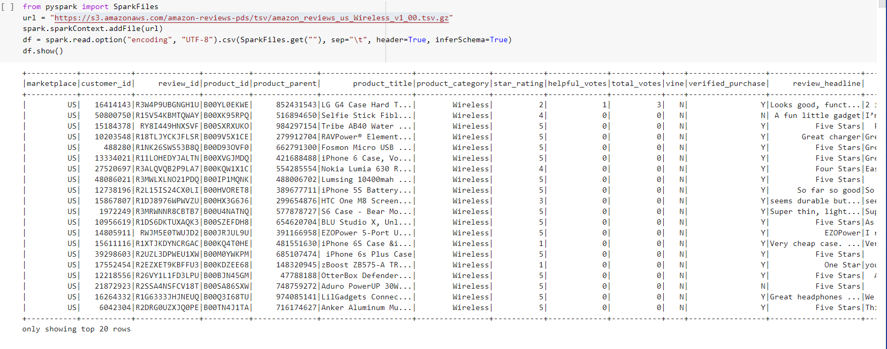
Figure 1.
Step 4 was to filter the total votes column to show only those that were 20. Also to further manipulate the data so that only helpful divided by total votes percentage was done and only those 50% or greater were used. See Figure 2.

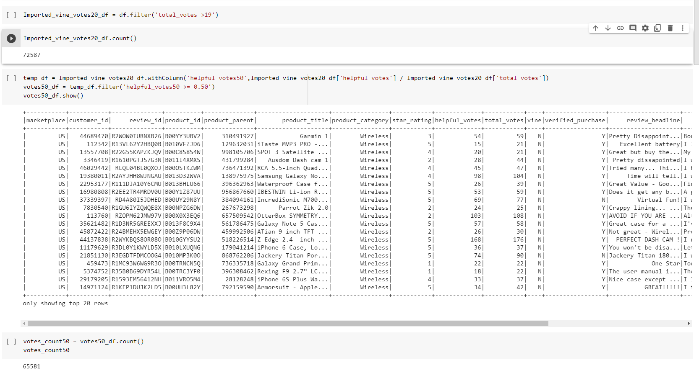
Figure 2.

Step 5 was to filter the total votes column to show only those with a 5 star rating. See figure 3.
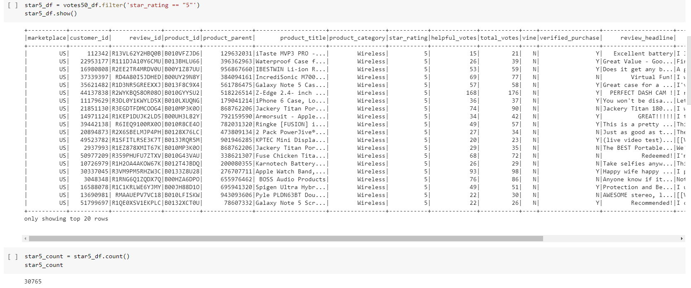
Figure 3.
Step 6 was to take the base over 50% dataframe and filter for vine only. This is partially shown here in figure 4.
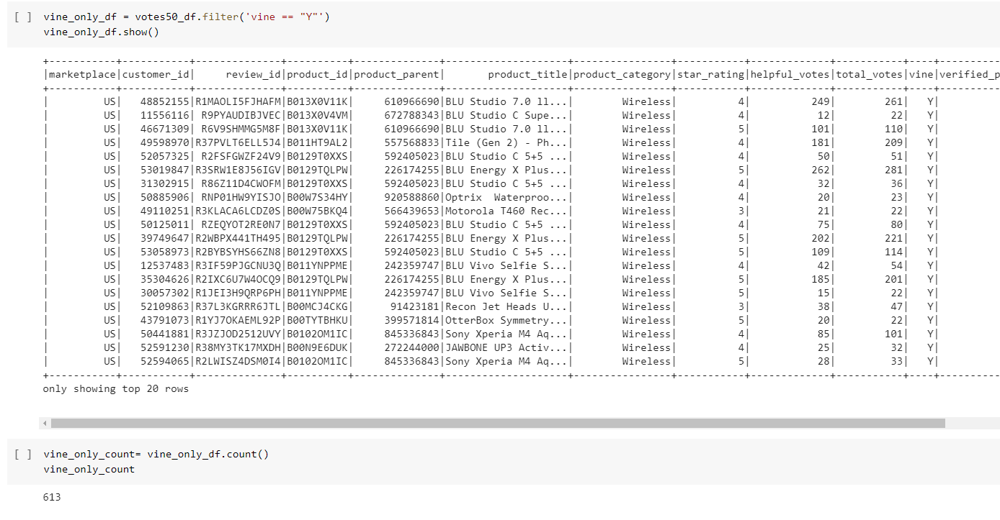

Figure 4.
Step 7 was to repeat this create a dataframe filtered to only show reviews that were vine reviews  and where star rating equals 5.  See figure 5.
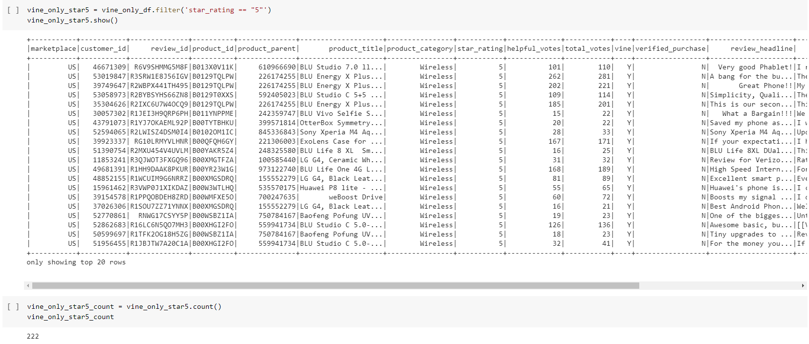
Figure 5.
Step 8 was to repeat this process for non-vine ratings. Figure 6 shows non-vine only votes and figure 7 shows non-vine only that were 5 star ratings.
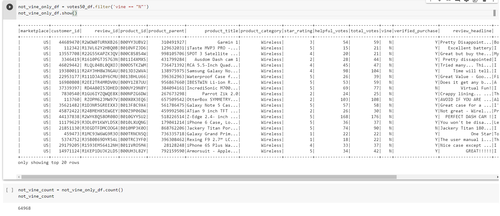
Figure 6

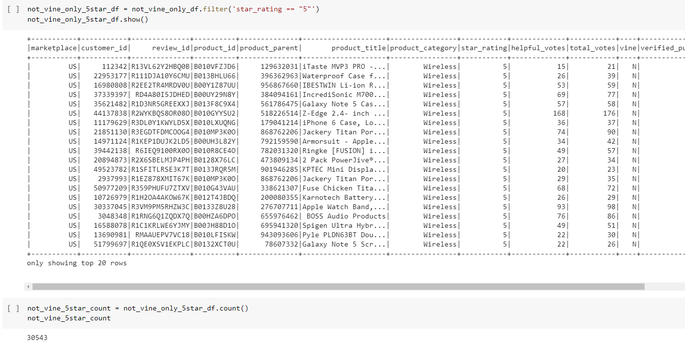
Figure 7.

Step 9 summarizes the vote counts for the above dataframes
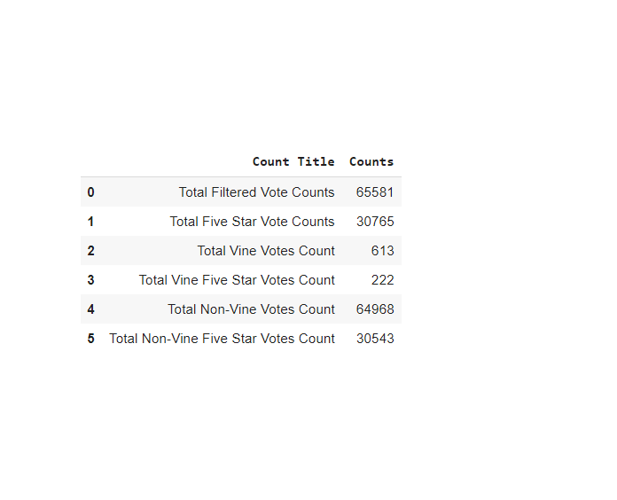
Figure 8.
Step 10 provides the percentages. See figure 9.
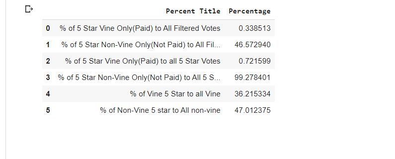
Figure 9.

## Summary
Lets first recap what questions the results answer.
1. The total number of reviews - 65,581
2. The number of 5-star reviews - 30,765
3. The percentage 5-star reviews are calculated for all Vine  reviews - 36.21%
4. The percentage 5-star reviews are calculated for all non-Vine reviews - 47%
Based on this analysis there is not any positivity bias in vine reviews. in fact there might be a negativity bias in vine reviews. Note that there is 10.8 percent less vine 5 star reviews as compared to non-vine 5 star reviews.

Additional percentages were produced as I was initially unsure where the bias may lay. The factors I considered in this were 5 star vine vs non-vine reviews compared against all reviews and vine vs non-vine reviews compared against 5 star reviews. From the great differences in the percentages due to the much greater number of non-vine reviews this does not make sense. Comparing 5 star vine and 5 star non-vine reviews against all vine reviews does make sense.

### Additional Analysis
For follow on analysis I recommend a statistical approach. After verifying the data follows a normal probability distribution, a two sided T test would provide confidence that there is or is no bias one way or the other. The following hypothesis could be used:
H0 = there is no differences in the number of 5 star reviews between vine reviews and non-vine reviews.
Ha = There is a difference in the number of 5 star reviews between vine reviews and non-vine reviews.

I created a pandas data frame and brought that into RStudio. There, I conducted a T test between the counts of 5 star vine vs 5 star non-vine total votes. Here are the results, Figure 8.
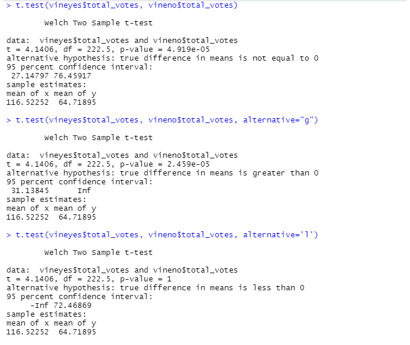

Figure 8.

The tope T test is a two sample T test with the above hypothesis. Give the very low p value, we reject H0, that there is now difference.

Now we progress to a different hypothesis:
H0 = The number of 5 star vine reviews are greater than the number of 5 star non-vine reviews.
Ha = The number of 5 star vine reviews are not greater than the number of 5 star non-vine reviews.
From the second T test and its small p value, which is less then a 0.05 significance level, we also reject H0.

Lastly our hypothesis is
H0 = The number of 5 star vine reviews is less than the number of 5 star non-vine reviews.
Ha = The number of 5 star vine reviews is not less that the number of 5 star non-vine reviews.
from the last T test, which has a p value of 1, we do not have sufficient evidence that the number of 5 star vine reviews is less than the number of 5 star non-vine reviews. We cannot reject H0.

Additionally, a comparison of analysis against different vine reviews (different products) is warranted as bias could exist for some but not others.

## Deliverable One
Below are images that show pgadmin with the loaded tables coming from AWS RDS.
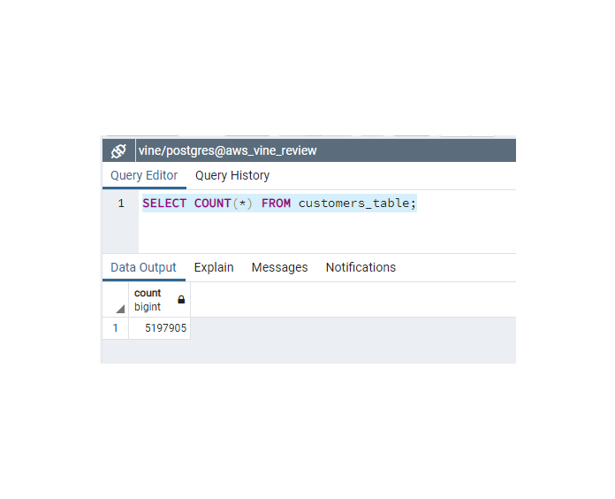
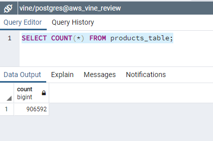

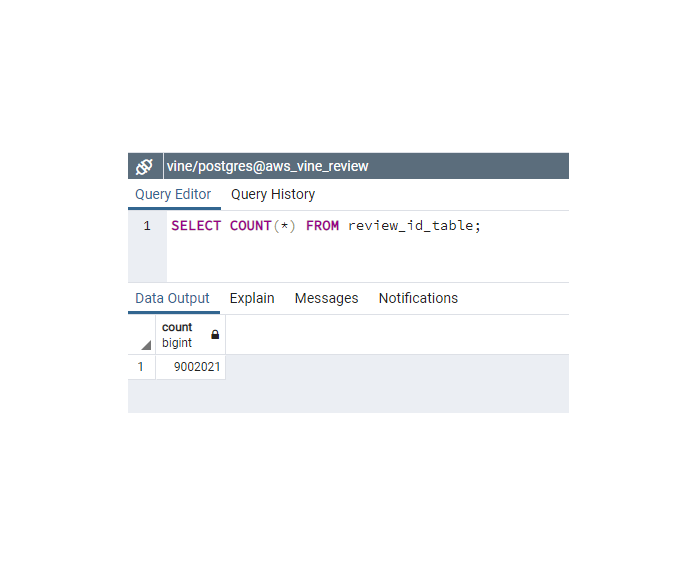
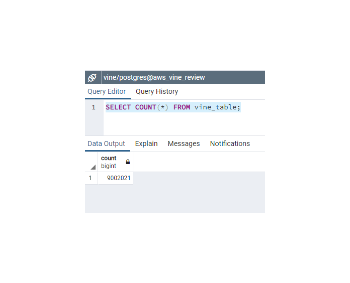

