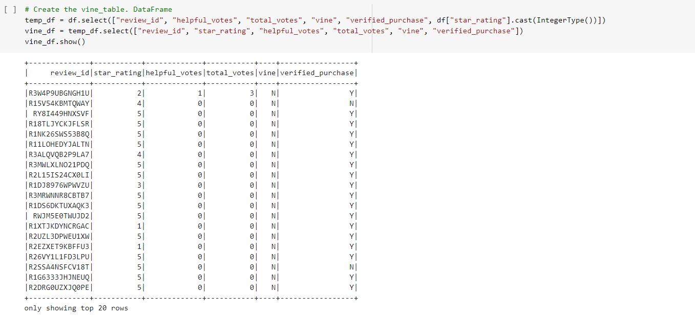
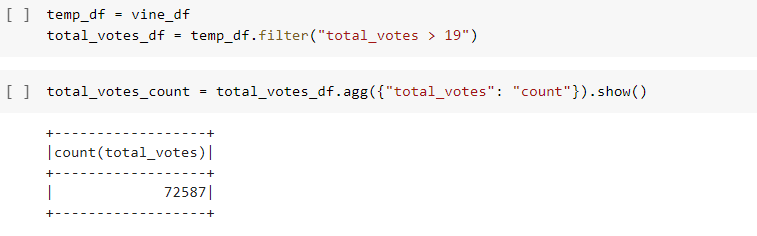
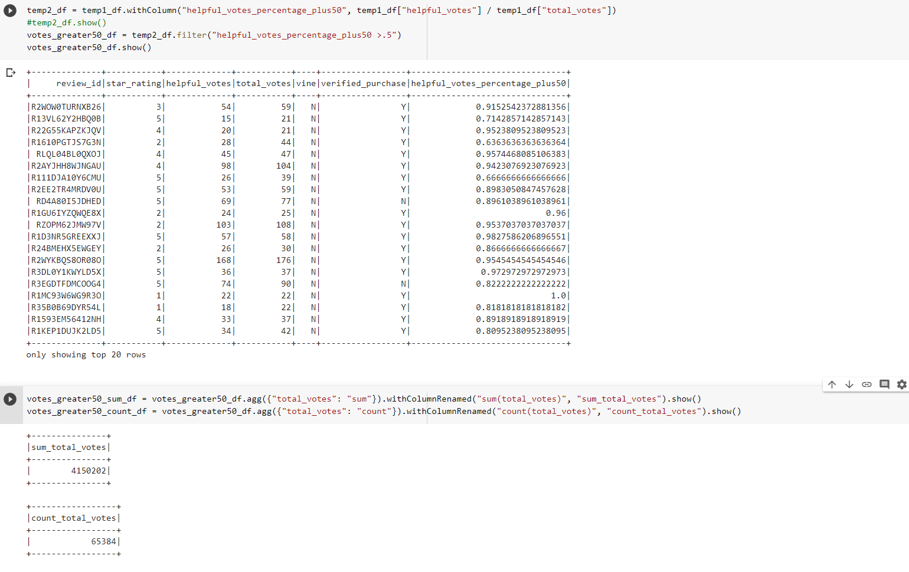
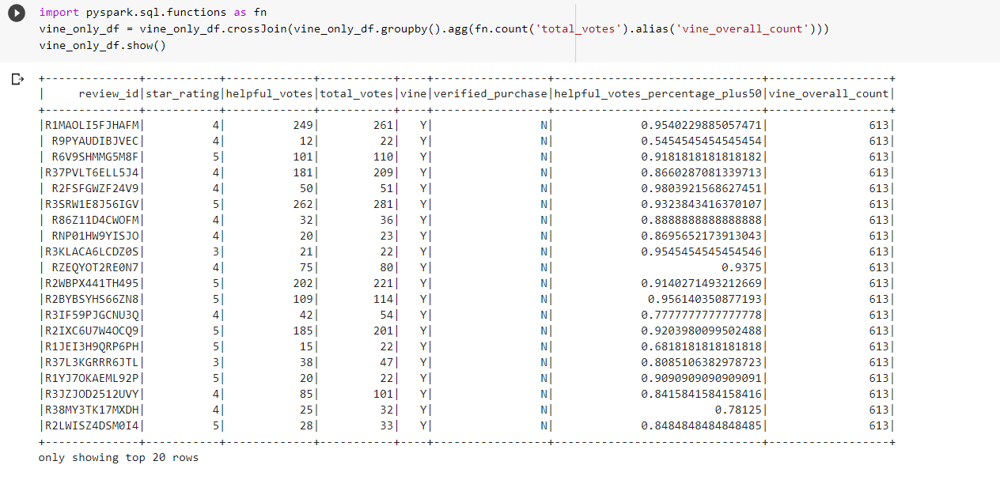
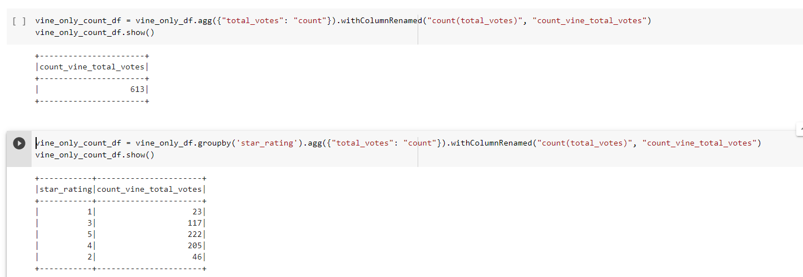
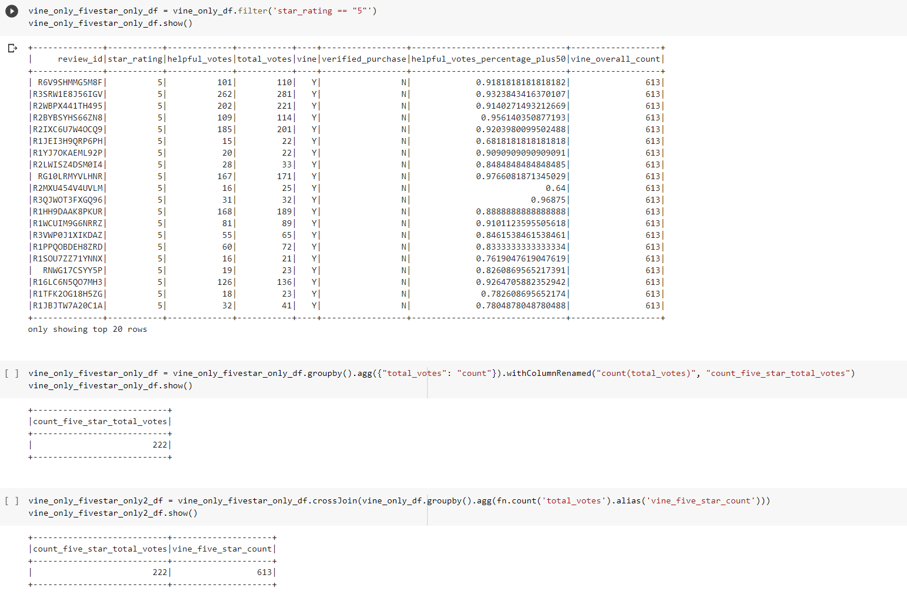
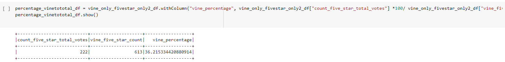
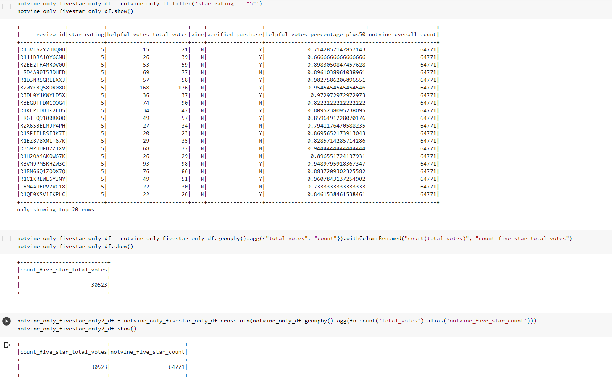
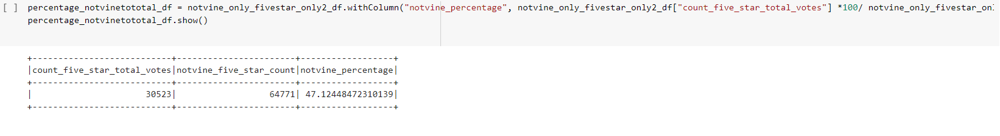

# Amazon_Vine_Analysis
## Analysis Overview
The purpose of this analysis is to determine if there is any positivity bias in Amazon Vine reviews.

The Amazon Vine program is a service that allows manufacturers and publishers to receive reviews for their products. Companies like SellBy pay a small fee to Amazon and provide products to Amazon Vine members, who are then required to publish a review.

There are over 50 data sets, representing different products, available. I chose the one for wireless products. That dataset is available here. (https://s3.amazonaws.com/amazon-reviews-pds/tsv/amazon\_reviews\_us\_Wireless\_v1_00.tsv.gz)

### Environments and Tools
This analysis was conducted in the Google COLAB environment using PYSPARK and PostgresSQL
The libraries used were:
1. pyspark.sql import SparkSession
2. pyspark.sql.functions import to_date
3. pyspark.sql.types import *
4. import pyspark.sql.functions as fn
## Analysis steps and Results
Step 1. was to set up the environment, download the postgreSQL driver and start a spark session.
Step 2 was to access the vine review file which is in a tsv format, url above.
Step 3 was to read the file into a data frame, partially shown here in figure 1.

Figure 1.
Step 4 was to review the data and create a data frame of the columns needed for this analysis. This also entailed casting the star_rating column from a string to and integer. That dataframe is partially shown here in figure 2.

Figure 2.
Step 5 was to filter the total votes column to show only those that were 20 or over. That and the count of votes are shown here in figure 3.

Figure 3.
Step 6 was to further manipulate the data so that only helpful votes percentage greater then 50% were used. This is partially shown here in figure 4. One can see the total vote count is now 65,384. This is the total number of reviews.

Figure 4.
Step 7 was to create a dataframe filtered to only show reviews that were vine reviews and then get the total number of vine reviews. This will be needed later. The final dataframe of this step (a 2 step process) is shown here in figure 5.

Figure 5.
Step 8 is now shown below in figure 6. This provides the total number of vine reviews and the breakout of vine reviews by star ratings. We are interested in the count of 5 star vine reviews, 222.

Figure 6
Step 8 was to create a dataframe that now only shows vine 5 star reviews. Shown here in figure 7. This is done in preperation for step 9. One can now see the 5 star vine reviews and the total number of vine reviews.

Figure 7.
Step 9 now takes those numbers and produces the percentage of vine 5 star reviews. That percentage is 36.22%. See figure 8. 

Figure 8.
Step 10 repeats this process for non vine reveiws. That initial filtered datframe is partially shown here in figure 9. Note the total non-vine reviews, 64,771.

Figure 9.
Step 11 prepares the data to capture the total non-vine reveiws and shows the non-vine reviews broken out by ratings. Again, were interested in the 5 star non vine reviews, 30,523. See figure 10

Figure 10
Step 12 is to prepare the data to get the percentage of non-vine 5 star reviews. This preperation is shown here in figure 11.

Figure 11.
Step 13, shown in figure 12 produces the percentage of non-vine 5 star ratings, 47.12%.

Figure 12.
## Summary
Lets first recap what questions the resulss answer.
1. How many vine reviews are there? 613.
2. How many non-vine reviews are there? 64,771
3. How many vine reviews were 5 star reveiws? 222
4. How many non-vine 5 star reviews are there? 30,523
5. What percentage of vine reviews were 5 stars? 36.22%
6. What percentage of non-vine revews were 5 stars? 47.12%
Based on this analysis there is not any positivity bias in vine reviews. in fact there might be a negativity bias in vine reviews. Note that there is 10.9 percent less vine 5 star reviews as compared to non-vine 5 star reviews.
### Additional Analysis
For follow on analysis I recommend a statistical approach. After verifying the data follows a normal probability distribution, a two sided T test would provide confidence that there is or is no bias one way or the other. The following hypothesis could be used:
H0 = there is no differences in the number of 5 star reviews between vine reviews and non-vine reviews.
Ha = There is a difference in the number of 5 star reviews between vine reviews and non-vine reviews.

This can be followed up with a one sided T test using a greater than and then a  less than criteria to focus in on any bias and its direction. A different, more specific hyposthesis would be needed here.

Additonally, a comparison of analysis agianst different vine reviews (different products) is warrented as bias could exist for some but not others.
